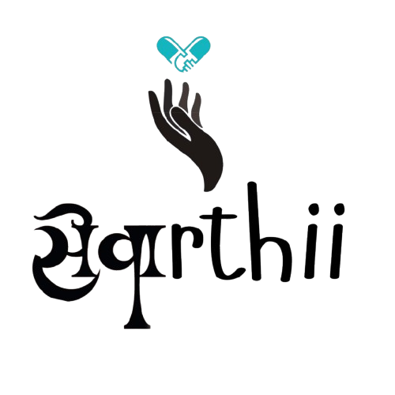

# 🌿 Sewarthii — Smart Health Companion

<p align="center">
  
</p>

<p align="center">
  <strong>Your all-in-one personal health management app — built for patients & caretakers.</strong><br/>
  Medicine reminders · Water tracking · Habit streaks · AI chat · Doctor contacts · Caretaker linking
</p>

<p align="center">
  <a href="https://github.com/Sahili04/Sewaarthi"></a>
  
  
  
</p>

---

## ✨ Features

### 💊 Medicine Management
- Add medicines with dosage, food timing, and multiple daily reminder times
- Mark medicines as **Taken / Missed / Pending**
- Smart **push notification reminders** even across browser tabs
- 🔊 Voice reminders in **English, Hindi & Marathi**
- 10-minute snooze support

### 💧 Water Tracker
- Track daily water intake with quick-add buttons (150ml / 250ml / 350ml / 500ml)
- Visual ring progress toward your daily goal
- Set custom **water reminder times**
- Syncs with health heatmap

### 🏃 Habit Tracker
- Log daily activities from presets (Walking, Yoga, Workout, Cycling…)
- Built-in activity timer with start/stop
- Streak visualization in the dashboard heatmap

### 📅 Health Streak Heatmap
- GitHub-style **365-day activity heatmap** on the dashboard
- Tracks medicine adherence, water intake & activity scores per day
- Hover tooltips with daily breakdown

### 🤖 AI Health Assistant
- Ask health questions, get medicine information
- Powered by integrated AI chat

### 📷 Prescription Scanner
- Scan prescriptions and auto-add medicines via AI OCR

### 🏥 Doctor Contacts
- Save doctor details: name, specialty, phone, hospital, available hours
- One-tap call from the app
- Emergency contact quick access on dashboard

### 👨‍⚕️ Caretaker System
- **Caretakers** register separately and send requests to patients via email
- **Patients** accept/reject incoming requests
- Accepted caretakers get access to their patient's:
  - Full medicine list & adherence stats
  - Today's water intake & habit summary
  - Missed dose alerts
- Caretakers have their own dedicated dashboard (no patient UI clutter)

### 📄 PDF Health Reports
- Generate downloadable PDF reports for any date range
- Includes medicine adherence rate, water stats, activity summary
- Styled with Sewarthii branding

### 🌐 Multi-Language Support
| Language | Code |
|----------|------|
| English | `en` |
| Hindi | `hi` |
| Marathi | `mr` |

---

## 🛠️ Tech Stack

| Layer | Technology |
|-------|-----------|
| Frontend Framework | React 18 + Vite |
| Styling | Vanilla CSS (custom design system) |
| Backend / Auth | Firebase (Firestore + Auth) |
| Auth Providers | Email/Password + Google Sign-In |
| Voice | Web Speech Synthesis API |
| Notifications | Web Notifications API |
| PDF Generation | jsPDF |
| Fonts | Google Fonts — Outfit, Plus Jakarta Sans |

---

## 🚀 Getting Started

### Prerequisites
- Node.js ≥ 18
- A Firebase project with Firestore & Authentication enabled

### Installation

```bash
# Clone the repository
git clone https://github.com/Sahili04/Sewaarthi.git
cd Sewaarthi

# Install dependencies
npm install

# Start development server
npm run dev
```

App will be available at **http://localhost:5173**

### Firebase Setup

1. Create a project at [Firebase Console](https://console.firebase.google.com)
2. Enable **Authentication** → Email/Password & Google
3. Enable **Firestore Database**
4. Replace the config in `src/firebase.js`:

```js
const firebaseConfig = {
  apiKey: "YOUR_API_KEY",
  authDomain: "YOUR_PROJECT.firebaseapp.com",
  projectId: "YOUR_PROJECT_ID",
  storageBucket: "YOUR_PROJECT.appspot.com",
  messagingSenderId: "YOUR_SENDER_ID",
  appId: "YOUR_APP_ID"
}
```

---

## 📁 Project Structure

```
src/
├── firebase.js              # Firebase config & exports
├── App.jsx                  # Root component, routing, reminders
├── index.css                # Global design system & utilities
├── locales/
│   └── translations.js      # EN / HI / MR translation strings
└── pages/
    ├── Login.jsx             # Auth (login, signup, Google, role select)
    ├── ProfileSetup.jsx      # Patient onboarding & health profile
    ├── Dashboard.jsx         # Home — stats, heatmap, medicine list
    ├── AddMedicine.jsx       # Add new medicine with reminders
    ├── AIAssistant.jsx       # AI health chat
    ├── PrescriptionScanner.jsx # OCR prescription scanner
    ├── DoctorContacts.jsx    # Doctor & emergency contact manager
    ├── WaterTracker.jsx      # Water intake tracking
    ├── Habittracker.jsx      # Daily activity tracker with timer
    ├── CaretakerDashboard.jsx # Caretaker & patient care network
    ├── Reports.jsx           # PDF report generator
    ├── IoTDevice.jsx         # IoT device integration
    └── SeedData.jsx          # 🌱 Dev tool — seeds 6 months of demo data
```

---

## 🌱 Demo Data Seeder

For demo/testing purposes, visit:

```
http://localhost:5173/?seed=1
```

This will populate **6 months of realistic health data** including:
- 10 medicines (chronic, supplements, acute)
- 4 doctor contacts
- 180 days of water intake with natural streaks
- Daily habit logs
- Pre-linked caretaker (Ananya Raut)

---

## 🔐 User Roles

| Role | Capabilities |
|------|-------------|
| **Patient** | Full app access — medicines, water, habits, reports, AI, scanner |
| **Caretaker** | Send requests to patients · View patient dashboard once accepted |

---

## 📸 Screenshots

> Login page, dashboard, caretaker view, water tracker, and heatmap available in the app.

---

## 🤝 Contributing

Pull requests are welcome! For major changes, please open an issue first.

---

## 📄 License

This project is built for educational and personal health management purposes.

---

<p align="center">Made with ❤️ by <strong>Sahili</strong> — Sewarthii 2025</p>
